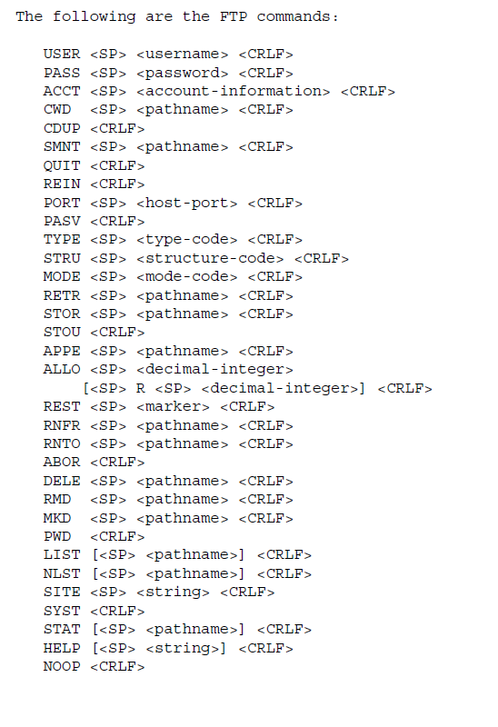
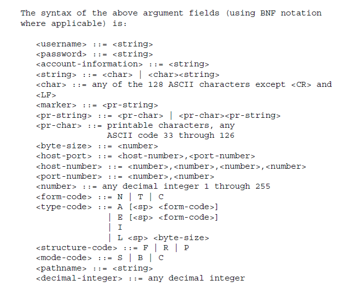
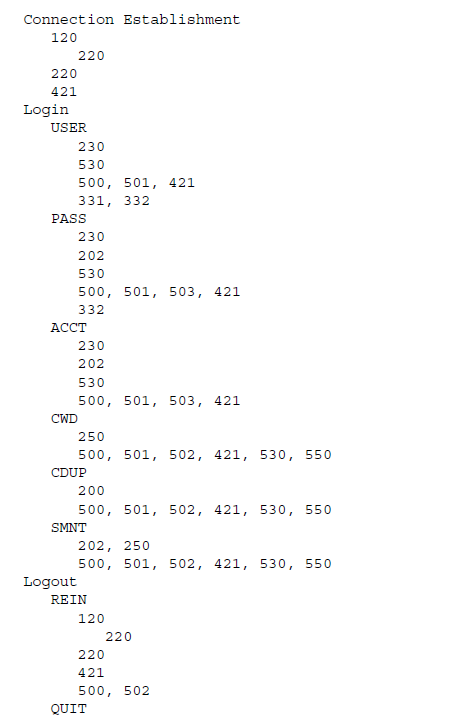

###### Access control identifiers:

-   USER
    -   User identification required by the server for access to its file system.
    -   First command transmitted by the user after the control connections are made
    -   new USER command has the effect of flushing any user, password, and account information already supplied
    -   Argument type: Telnet string
-   PASS
    -   specifying the user’s password
    -   This command must be immediately preceded by the user name command
    -   responsibility of the user-FTP process to hide the sensitive password information
    -   Argument type: Telnet string
-   ACCT
    -   Identifying the user’s account
    -   Argument type: Telnet string
-   CWD
    -   User can CHANGE WORKING DIRECTORY without altering his login or accounting information
    -   Argument type: pathname specifying a directory
-   CDUP
    -   CHANGE TO PARENT DIRECTORY
    -   Argument type: pathname specifying a directory
-   SMNT (STRUCTURE MOUNT)
    -   to mount a different file system data structure without altering his login or accounting information
    -   Argument type: pathname specifying a directory
-   REIN
    -   REINITIALIZE command terminates a USER, flushing all I/O and account information, except to allow any transfer in progress to be completed
    -   All parameters are reset to the default settings and the control connection is left open
-   QUIT
    -   This command terminates a USER and if file transfer is not in progress, the server closes the control connection
    -   If file transfer is in progress, the connection will remain open for result response and the server will then close it

###### TRANSFER PARAMETER COMMANDS

-   PORT
    -   DATA PORT for specifying the data port to be used in data connection.
    -   The argument is the concatenation of a 32-bit internet host address and a 16-bit TCP port address, broken into 8-bit fields and the value of each field is transmitted as a decimal number (in character string representation). (e.g. PORT h1,h2,h3,h4,p1,p2)
-   PASV
    -   PASSIVE command requests the server-DTP to "listen" on a data port (which is not its default data port) and to wait for a connection rather than initiate one upon receipt of a transfer command. The response to this command includes the host and port address this server is listening on.
-   TYPE
    -   Specifies Data Representation type
    -   Parameter 1: Single telnet character
    -   Second Format parameter for ASCII and EBCDIC <!-- TODO: Review the TRANSFER PARAMETER COMMANDS to understand the second format parameter. Determine if they are necessary. -->
    -   Parameter 2 for local byte is a decimal integer to indicate Byte size
    -   Parameters separated by a <SP> i.e. space
    -   Default representation type is ASCII Non-print.

|      Code     |         Type         |
| :-----------: | :------------------: |
|       A       |         ASCII        |
|       E       |        EBCDIC        |
|       I       |         Image        |
| L <byte size> | Local byte Byte size |

| Code |           Type          |
| :--: | :---------------------: |
|   N  |        Non-print        |
|   T  | Telnet format effectors |
|   C  |  Carriage Control (ASA) |

-   STRU

    -   Argument is a single Telnet character code specifying file structure

| Code |            Type            |
| :--: | :------------------------: |
|   F  | File (no record structure) |
|   R  |      Record structure      |
|   P  |       Page structure       |

-   MODE
    -   The argument is a single Telnet character code specifying the data transfer modes
    -   default transfer mode is Stream.

| Code | Transfer Mode |
| :--: | :-----------: |
|   S  |     Stream    |
|   B  |     Block     |
|   C  |   Compressed  |

###### FTP SERVICE COMMANDS:

-   RETR
    -   Retrieve command causes the server-DTP to transfer a copy of the file, specified in the pathname to caller.
-   STOR
    -   Store command causes the server-DTP to accept the data transferred via the data connection and to store the data as a file at the server site.
        -   Replaces existing or creates a new file to store the file being transferred.
-   STOU        
    -   In Store unique, file created in the current directory under a name unique to that directory. The 250 Transfer Started response must include the name generated.
    -   The 250 Transfer Started response must include the name generated.    
-   APPE
    -   In APPEND, if the file specified in the pathname exists at the server site, then the data shall be appended to that file.
    -   Else otherwise the file specified in the pathname shall be created at the server site.
-   ALLO
    -   Argument shall be a decimal integer representing the number of bytes (using the logical byte size) of storage to be reserved for the file.
    -   Should be treated as a NOOP (no operation)by those servers which do not require that the maximum size of the file be declared beforehand, and those servers interested in only the maximum record or page size should accept a dummy value in the first argument and ignore it.
-   REST
    -   Argument field is the server marker at which file transfer is to be restarted
    -   Must be followed by the appropriate FTP service command for file transfer to resume.
-   RNFR
    -   RENAME FROM specifies the old pathname of the file which is to be renamed.
    -   This command must be immediately followed by a "rename to" command specifying the new file pathname.
-   RNTO
    -   RENAME TO specifies the new pathname of the file specified in the immediately preceding "rename from" command. Together the two commands cause a file to be renamed.
-   ABOR
    -   The control connection is not to be closed by the server, but the data connection must be closed.
    -   If the FTP service command was already completed
    -   Else (i.e. the FTP service command is still in progress)
        -   the server closes the data connection (if it is open) and responds with a 226 reply, indicating that the abort command was successfully processed
        -   aborts the FTP service in progress and closes the data connection, returning a 426 reply to indicate that the service request terminated abnormally. Then sends a 226 reply.
-   DELE
    -   File specified in the pathname will be deleted at the server site.
-   RMD  (Remove directory)
    -   if the pathname is absolute, server removes as a directory the directory with that pathname.
    -   if the pathname is relative, remove subdirectory of the current working directory
-   MKD
    -   Same as mkdir in Linux, for creation of directory or subdirectory according to pathname(either absolute or relative respectively)
-   PWD
    -   Path of the current directory of the server is returned in the reply
-   LIST
    -   From the server to the passive DTP.
    -   Server transfers a list of files in the specified directory.
    -   If the pathname specifies a file then the server should send current information on the file.
-   NLST
    -   NAME LIST
    -   a null argument implies the current directory
    -   The server will return a stream of names (in ASCII or EBCDIC) of files and no other information.
-   SITE
    -   SITE PARAMETERS is used by the server to provide services specific to his system that are essential to file transfer but not sufficiently universal to be included as commands in the protocol.
    -   The nature of these services and the specification of their syntax can be stated in a reply to the HELP SITE command.
-   SYST
    -   Used to find out the type of operating system at the server.
    -   The reply shall have as its first word one of the system names listed in the current version of the Assigned Numbers document.
-   STAT    
    -   Status response is sent _through the control connection_ as a reply.
    -   It may be sent either during or between file transfers.
    -   If no argument is given, the server should return general status information about the server FTP process. This should include current values of all transfer parameters and the status of connections.
-   HELP
    -   Server sends helpful information regarding its implementation status _over the control connection_ to the user.
    -   The reply is type 211 or 214.
-   NOOP
    -   Specifies no action other than that the server send an OK reply.

###### Purposes of FTP replies

-   User always is synchronized and knows states of the server
-   Every command must generate at least one reply
-   A failure at any point in the sequence necessitates the repetition of the entire sequence from the beginning
-   consists of a three digit number (transmitted as three alphanumeric characters) followed by some text
-   The number is intended for use by automata to determine what state to enter next

###### Structure of FTP Replies

-   A reply is defined to contain the 3-digit code, followed by Space <SP>, followed by one line of text (where some maximum line length has been specified), and terminated by the Telnet end-of-line code.
-   Server implementations should not invent new codes for situations that are only slightly different from the ones described here, but rather should adapt codes already defined.
-   In the following explanation of the digits the variables x, y and z will be used to represent any other possible value that might be substituted in those spaces such that the resulting 3 digit code is a FTP reply code.
-   Digit #1: indicates that response is good, bad or incomplete. For user to determine its next action.
    -   1yz Positive Preliminary reply:
        -   The requested action is being initiated; expect another reply before proceeding with a new command.
        -   The server-FTP process may send at most, one 1yz reply per command.
    -   2yz Positive Completion reply:
        -   Action completed, you can start new request.
    -   3yz Positive Intermediate reply:
        -   Command accepted, but requested action is in abeyance, waiting for information that user must send.
    -   4yz Transient Negative Completion reply:
        -   Command was not accepted but the error condition is temporary and the action may be requested again.
        -   Replies are 4yz if the commands can be repeated without any change in command form or in properties of the User or Server.
    -   5yz Permanent Negative Completion reply:
        -   The command was not accepted. The User-process is discouraged from repeating the exact request (in the same sequence).
-   Digit #2: What kind of error occurred?
    -   x0z Syntax: Syntax error
    -   x1z Information: these are replies to requests for information
    -   x2z Connections: Connection error
    -   x3z Authentication and accounting: Replies for the login process and accounting procedures
    -   x4z Unspecified as yet
    -   x5z File system: indicate the status of the Server file system in relation with requested file action
-   Digit #3: for the finest gradation of information of the info provided by 2nd digit (e.g., RNTO command without a preceding RNFR).

<!-- TODO: Design coding plan that divides the coding work between the team members and establishes the rule for the creating of branches and merges in git/github. -->

