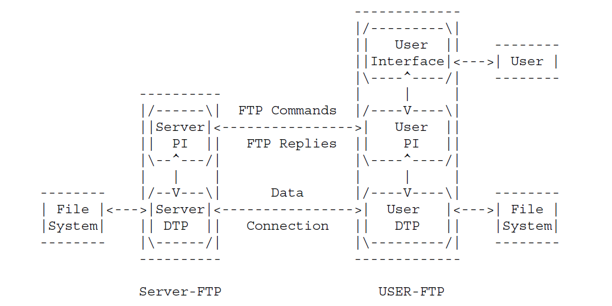

<!-- TODO: Centralize tables as much as possible at the end because of beautify -->

<!-- TODO: Make a separate Markdown file and attach the FSM necessary images. -->

# Summary FTP (Luis Monroig)

| Acronym |            Meaning            |
| :------ | :---------------------------: |
| RFC     |      Request for Comment      |
| TCP     | Transmission Control Protocol |
| NVT     |    Network Virtual Terminal   |
| NVFS    |  Network Virtual File System  |
| PI      |    The protocol interpreter   |
| DTP     |     Data Transfer Process     |

###### Objectives of FTP:

-   Promote sharing of files
-   Encourage indirect or implicit (via programs) use of remote computers
-   To shield a user from variations in file storage systems among hosts
-   To transfer data reliably and efficiently

###### Purposes Transferring Files:

-   Printing => receiver knows vertical format control is represented
-   Storage => to store a file at a host and then retrieve it later in exactly the same form
-   Retrieval
-   Processing

###### FTP Components (Overview)

###### User FTP Process Requirements for File Transfer:

-   Protocol Interpreter
-   Data Transfer Process (DTP)
-   User interface
-   Cooperation with one or more server-FTP processes

###### Notice that there exist two types of connections

-   Control connection
    -   Used for the transfer of commands
    -   Implies communication path between the USER-PI and SERVER-PI
    -   Implies Telnet Protocol
    -   Must be closed by the server at the user’s request after all transfers and replies are completed. <!-- TODO: Figure out how would this be done-->
-   Data connection.
    -   Where files are transferred through

The user-PI and server-PI are programs that interpret user commands and server commands. More details of DTP can be found in (pp. 18 RFC). Data connection (DTP) in FTP is in full duplex connection.

The user-DTP must "listen" on the specified data port; this may be the default user port (U) or a port specified in the PORT command.

**Def:** The **logical byte size** is the a byte size for interpretation. Is mostly dependant on the type of file or the way it is stored or processed.

**Def**: The **transfer byte size** is 8-bit bytes. This byte size is relevant only for the actual transfer of the data

###### DTP Requires the following basic requirements to establish any data connection:

-   Setting up the data connection to the appropriate ports
    -   Remember that the user-process default data port is the same as the control connection port (i.e., U).
    -   The server-process default data port is the port adjacent to the control connection port (i.e., L-1).
-   Choosing the parameters for transfer
-   Transfer request is sent from client to server  
-   The server, upon receiving the  will initiate the data connection
    to the port.
-   Server PI must send a confirming PI to the user-PI

###### Two types of DTP connections

-   Passive
-   Active

The User-PI may specify a non-default user side data port with the PORT command(_e.g. set port of the 3rd party server_). The User-PI may request the server side to identify a non-default server side data port with the PASV command.

###### The server-PI:

-   Establishes _control communication connection_
-   Receives standard FTP commands from the user-PI
-   Sends replies
-   Governs the server-DTP

###### The User-PI

-   Initiates the control connection from its port U to the server-FTP process
-   Initiates FTP commands
-   Governs the user-DTP if that process is part of the file transfer

###### The FTP commands:

-   Specify the parameters for the data connection:
    -   Data port
    -   Transfer mode (specify how the bits of the data are to be transmitted)
    -   Representation type (define the way in which the data are to be represented)
    -   Structure (define the way in which the data are to be represented)
    -   nature of file system operation (e.g. store, delete)
-   4tuple ()

(See page 9 and 45 of the RFC for more info about transfer between 3rd party hosts)

###### Transferring modes:

All data transfers must be completed with an end-of-file (EOF) which may be explicitly stated or implied by the closing of the data connection.

For the purpose of standardized transfer, the sending host will
translate its internal end of line or end of record denotation
into the representation prescribed by the transfer mode and file
structure, and the receiving host will perform the inverse
translation to its internal denotation.

End-of-line in an ASCII or EBCDIC file with no
record structure should be indicated by <CRLF> or <NL>,
respectively.

`Identical systems transferring non-record structured text files might wish to use a binary representation and stream mode for the transfer.`

###### Transmission modes:

-   STREAM MODE
    -   passes the data with little or no processing
    -   data is transmitted as a stream of bytes
    -   If the structure is a file structure, the EOF is indicated by the sending host closing the data connection and all bytes are data bytes
-   BLOCK MODE
    -   series of data blocks preceded by one or more header bytes
    -   header bytes contain in 24 bits the total length of the data block in bytes and in 8 high order bits a descriptor code
    -   formats the data and allows for restart procedures
-   COMPRESSED MODE
    -   one which also compresses the data for efficient transfer
    -   three kinds of information to be sent:
        -   Regular data, sent in a byte string
        -   Compressed data, consisting of replications or filler
        -   Control information, sent in a two-byte escape sequence

###### File Structure:

-   file-structure (default) (must be accepted) (We will focus on this one!)
    -   file considered to be a continuous sequence of data bytes
-   record-structure (default) (must be accepted)
    -   file is made up of sequential records
-   page-structure
    -   file is made up of independent indexed pages

<!--TODO: ¿telnet string? -->

###### Minimal Requirements for TCP:

-   TYPE - ASCII Non-print
-   MODE - Stream
-   STRUCTURE - File, Record
-   COMMANDS - USER, QUIT, PORT, TYPE, MODE, STRU, for the default values RETR, STOR, NOOP.
-   The default values for transfer parameters are:
    -   TYPE - ASCII Non-print
    -   MODE - Stream
    -   STRU - File

Note that all FTP implementation must support data transfer using the default port, and that only the USER-PI may initiate the use of non-default ports.

All hosts must accept the above as the standard defaults.
