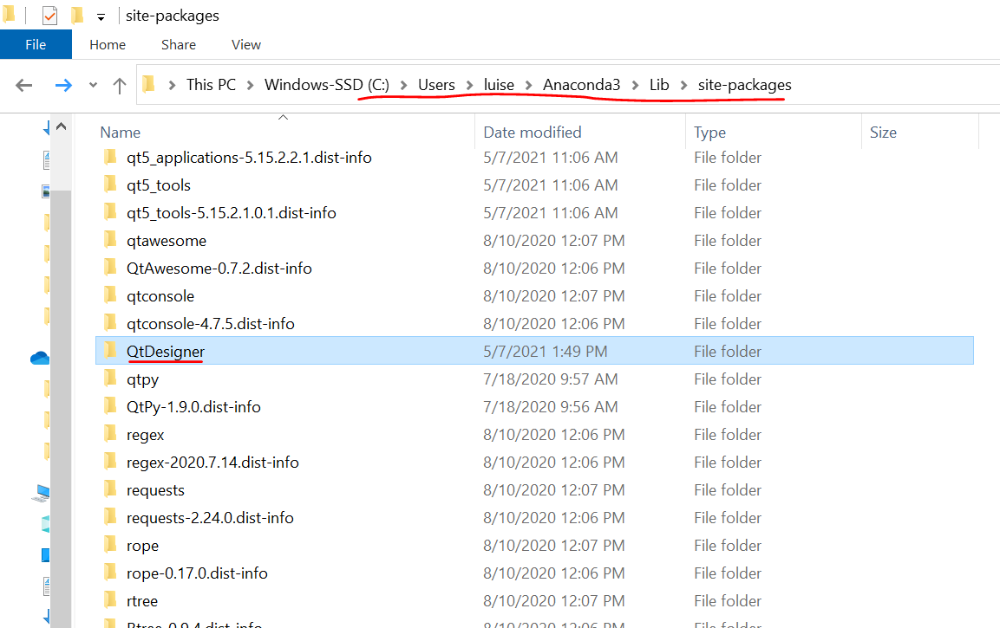
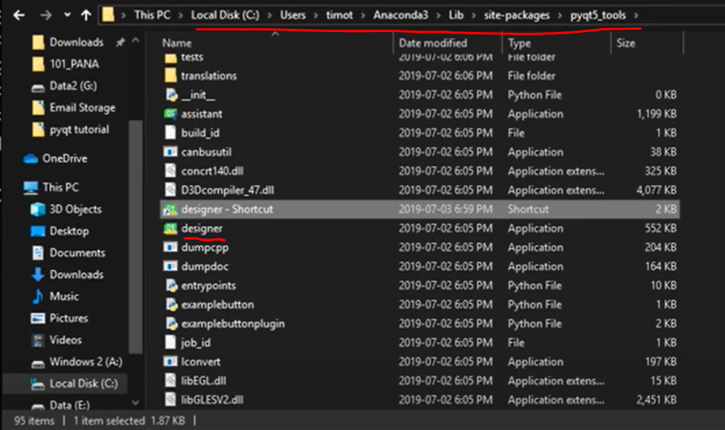

## Relevant Python Libraries for FTP implementation

-   [ ] [import socket (by Tech with Tim)](https://www.youtube.com/watch?v=3QiPPX-KeSc), [by Sentdex Part 1 (there are 3 parts and an additional video of making a chatroom with sockets)](https://www.youtube.com/watch?v=Lbfe3-v7yE0)
-   [X] [import threading (by Corey Schafer)](https://www.youtube.com/watch?v=IEEhzQoKtQU)
-   [X] [import struct (by Asha Tutorials)](https://www.youtube.com/watch?v=y49OUKBCEek)
-   [X] [import os (by Corey Schafer)](https://www.youtube.com/watch?v=tJxcKyFMTGo&t=43s)
-   [ ] [import sys (by Sentdex)](https://www.youtube.com/watch?v=rLG7Tz6db0w)
-   [ ] [PyQT5 by Tech With Tim](https://www.youtube.com/watch?v=-2uyzAqefyE&list=PLzMcBGfZo4-lB8MZfHPLTEHO9zJDDLpYj&index=2)

An intro to FTP can be seen in the following video: [Animated FTP Intro](https://www.youtube.com/watch?v=tOj8MSEIbfA)

* * *

#### Summary of the import os library:

First let us review the OS python library and its basic file navigation commands.

> Reference: [Corey Schafer video on the OS Module](https://www.youtube.com/watch?v=tJxcKyFMTGo)

###### Command structure
In general, important
commands of linux can be used in python using the os module with commands with the following syntax:

            os.linux_command(input_of_command).
Most of the times linux_command is a minor syntax variation of an equivalent linux command.

###### Commands for simple file navigation:

            os.chdir(path), os.mkdir(directory_name),
            os.mkdirs(str_names_directory_branch), os.listdir(), os.getcwd(),
            os.rmdir(), os.removedirs(), os.rename(file_or_directory,new_name)

###### Other common and useful OS module commands:
|  Function of os Library  |                         Description              |
|:-----|---------:|
|os.stat()                      | for info of files and directories|
|os.walk(path_of_directory)     | to obtain files and directory info of full subtree returns 3-tuple|
|os.environ.get(some_variable)  | os.environ object is a dict with useful info accessed with get()|
|os.path.join(path1,path2)      | joins paths safely|
|os.path.exists(path)           | returns true if path does exist in file system|
|os.path.isdir(path)            | returns true if path is a file |
|os.path.isfile(path)           | returns true if path is a directory |
|os.path.splitext(path)         | returns (path_with_name_no_exception,extension) |

---

#### Summary of the import threading library:

**Def**: There are lines of code known as, blocking lines, that stop the execution of the program.(_e.g. conn.recv(HEADER) from the socket module_)

###### How to start a thread?

Create and assign the thread object to a variable. Argument target is the name of the function that will execute in the thread and args is a list with the arguments in the same order as the function receives them.
(_e.g. arrival_thread = threading.Thread(target=put_line, args=[line])_)

After that remember to start the thread when necessary as follows: thread_object.start(). (\_e.g. arrival_thread.start()_)

###### How to end a thread?

.close()?

* * *

#### Summary of the import struct library:

import struct is used for conversions between Python values and C structs represented as Python bytes objects. [Intro struct.](https://www.youtube.com/watch?v=PGAtCGqt06U)

Use the format characters table to create a format string that when used as the first  parameter of the functions in the struct module, describe how the function will convert your value (maybe in a c or python built-in variable) to bytes or vice versa (i.e. from bytes to some python type).

Consider the following example:

    >>> from struct import *
    >>> pack('hhl', 1, 2, 3)
    b'\x00\x01\x00\x02\x00\x00\x00\x03'
    >>> unpack('hhl', b'\x00\x01\x00\x02\x00\x00\x00\x03')
    (1, 2, 3)
    >>> calcsize('hhl')
    8

The pack function from the struct module contains a format string and a few values that will be converted to python bytes by following the pattern established in the format string. This format string has been created following the format character table found [here.](https://docs.python.org/3/library/struct.html#format-characters)

Notice that the bytes are being stored in the string in a little endian system.

**Def**: A **big-endian system** stores the most significant byte of a word at the smallest memory address and the least significant byte at the largest.

**Def**: A **little-endian system**, in contrast, stores the least-significant byte at the smallest address.

Some computers automatically choose whether to use little endian or big endiand. Use sys.byteorder to check the endianness of your system.

Consider the following example:

    >>> pack('ci', b'*', 0x12131415)
    b'*\x00\x00\x00\x12\x13\x14\x15'
    >>> pack('ic', 0x12131415, b'*')
    b'\x12\x13\x14\x15*'
    >>> calcsize('ci')
    8
    >>> calcsize('ic')
    5

Notice that order affects the size. Also, you can use integers in the format strings to adapt the size of the padding and of the object being sent.

    >>> pack('c15s', b'*', b'Luis Monroig')
    b'*Luis Monroig\x00\x00\x00'

<!-- TODO: 1 Understand the iter_unpack() function -->
<!-- TODO: 2 Understand how the padding would work -->

* * *

#### Summary of the PyQt5 library:

The PyQt5 is a cross platform GUI designer framework that uses the famous Qt designer technology but for python applications. Since it is not a built in module, it must be downloaded to your computer via a pip or conda install command.  

###### Installation

The following pip commands (or the conda equivalents) should work for installing all that will be necessary for using PyQt5 for basic to intermediate GUI design:   
- pip install pyqt5
- pip install pyqt5-tools
- pip install PyQt5Designer

Once those are completed you can go ahead and write a simple GUI program. One of the most useful tools for this is the QtWidgets module from the PyQt5 module. As usual you can use it as follows:

    from PyQt5 import QtWidgets

Always the QApplication, QMainWindow, and QLabel classes are used. Thus, for convenience we use:

    from PyQt5.QtWidgets import QApplication, QMainWindow, QLabel.

This allows us for example to use app = QApplication(sys.argv) instead of app = QtWidgets.QApplication(sys.argv).

The Qt framework has an desktop app that allows users to design UI and preview them with drag and drop features and can latter convert all the design into python code. After converting the design to python code you can edit the code to improve the design further and add other details. The command pip install PyQt5Designer mentioned before already installs this desktop app for you. The tricky part know is to find it in you computer.

The following images provide a good place to look for to find this desktop app:

The goal is to find the following icon, to create a short cut by right clicking it and to drag and drop that shortcut to your desktop for easier access.

###### Converting a QT Design to a Python Script
- Save the design a local directory
- Navigate to the path of that directory using a terminal or cmd
- Use the following command convert the ui file into a py file:
    - pyuic5 -x name_file.ui -o name_python_file.py
-Check if a file named name_python_file.py is in the directory

* * *

#### Summary of import socket (by Tech with Tim) video

In TCP the sockets are required to be a 4-tuple.  
        _e.g. (source IP, source port#, destination IP, destination port)_

-   [ ] Review socket.socket() parameters and meaning

    -   [ ]

-   Code of the tutorial can be found here: [Sockets Tutorial](https://www.techwithtim.net/tutorials/socket-programming/)

#### Summary of import pickle

import pickle ?: [Serialización Piladoras Informaticas](https://www.youtube.com/watch?v=SOimkkfQIOM), [Pickle Real Python](https://www.youtube.com/watch?v=XzkhtWYYojg).

